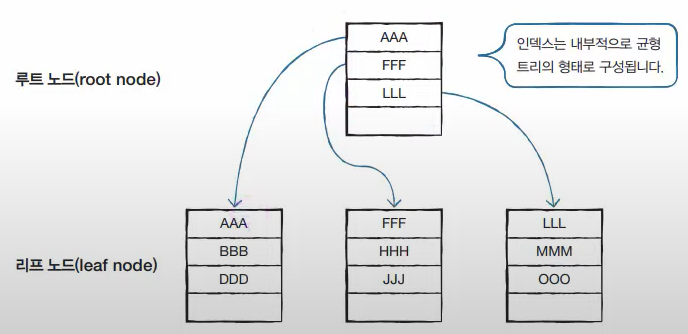
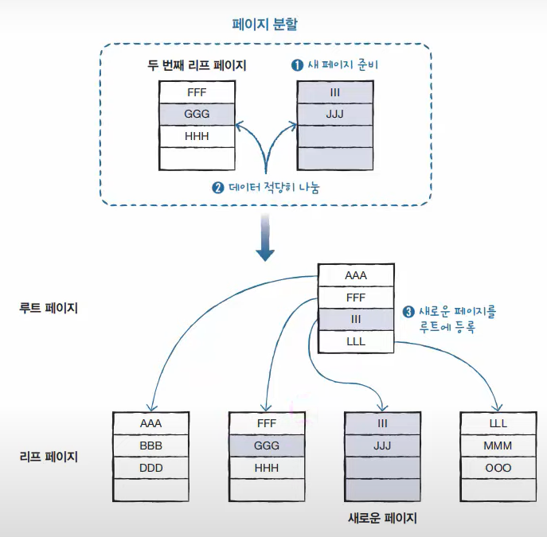
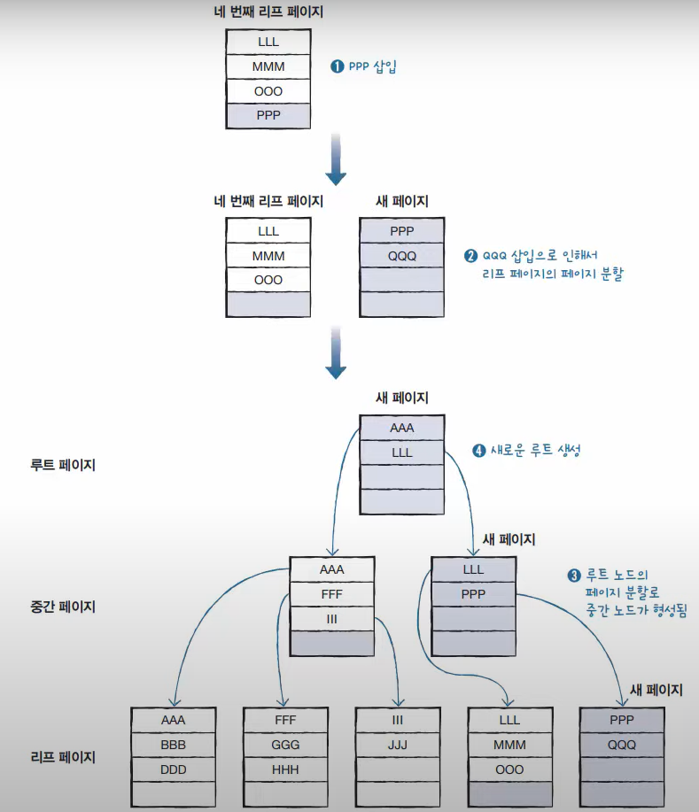
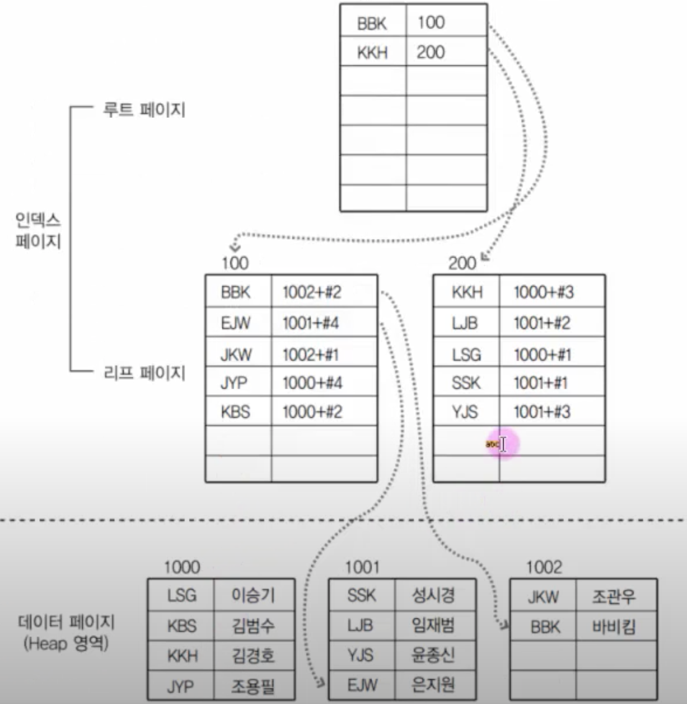

# 인덱스
- **`인덱스`** 란 책의 뒷부분 **<찾아보기> 페이지**와 같은 개념이라 생각하면 된다.
- 검색을 할 때 특히 대용량 데이터를 다룰 때 인덱스가 있으면 **빠르게** 찾을 수 있다.

### 장점
- 검색이 빨라진다
- 쿼리의 부하가 줄어 시스템 전체 성능이 향상된다.

### 단점
- 공간을 차지(5~20%정도)하기 때문에 용량이 커진다
- insert, update, delete등의 **데이터 변경 작업 시** index도 바껴야 되기 때문에 **수행 속도가 느려질 수 있다.**

# 인덱스의 종류
- **`클러스터형 인덱스`** = 영어 사전. 즉 **내용 자체가 인덱스**고 **정렬**되어 있음
  - 테이블당 한 개만 생성가능
  - 행 데이터를 인덱스로 지정한 열에 맞춰 **자동 정렬**한다.
- **`보조 인덱스`** (비 클러스터형 인덱스) = 책의 뒷부분 <찾아보기> 페이지
  - 테이블당 **여러 개** 생성가능

## 자동으로 생성되는 인덱스
- **primary key**를 등록하면 그 열은 **`클러스터형 인덱스`** 가 자동 생성된다.
  - 데이터가 오름차순으로 정렬된다.
- **Unique**를 사용하면 그 열은 **`보조 인덱스`** 가 자동 생성된다.
- **Unique + Not Null**을 사용하면 그 열은 **`클러스터형 인덱스`** 가 자동 생성된다.<br/>
:mag_right: 하지만 **primary key**가 테이블에 있다면 **Unique + Not Null 열은 `보조 인덱스`가 된다**

# 인덱스의 작동 과정
- **`클러스터형 인덱스`** 와 **`보조 인덱스`** 는 모두 내부적으로 **균형 트리**로 만들어진다.

### 균형 트리 (Balanced Tree, B-Tree)
- 균형 트리는 **데이터를 검색하는 데 효율적**으로 이루어져 있다.
- 뿌리 - 줄기 - 잎 을
- **`루트`** - **`중간`** - **`리프`** 라고 부른다.


- **데이터가 저장되는 공간을 `노드(Node)`라고 부른다.** MySQL에서는 노드를 페이지(Page)라고 부른다.
## 페이지 분할
- **데이터 삽입 시 페이지에 삽일 할 공간이 없으면 페이지 분할이 일어난다**
- 이 과정 때문에 데이터 삽입 **속도가 느려진다**는 단점이 있다.
### GGG와 III를 삽입하는 경우 리프 페이지 분할


### PPP와 QQQ를 삽입하는 경우


## 클러스터형 인덱스와 보조 인덱스의 특징 정리


[보조인덱스 구조에 대한 그림]

### 클러스터형 인덱스
- **`클러스터형 인덱스`** 는 **생성 시 데이터 페이지 전체가 다시 정렬**된다.
  - 데이터 페이지가 리프 페이지 이기 때문이다.
  - 그러므로 대용량 데이터가 이미 입력 된 상황이라면 클러스터형 인덱스를 생성하는 것은 시스템 부하를 줄 수 있기 때문에 충분히 고려해봐야 한다.
    - => 데이터 삽입이 보조 인덱스보다 느리다.
- 데이터 **검색이 빠르다.**

### 보조 인덱스
- 클러스터형 인덱스 보다 검색은 느리지만 **삽입은 빠르다.**
- 보조 인덱스는 여러 개 생성할 수 있다.<br/>
:mag_right: 인덱스를 제거할 때는 **보조 인덱스부터 제거한다** : 인덱스가 혼합되어 있는 경우엔 보조 인덱스가 데이터 페이지의 주소가 아닌 클러스터형 인덱스를 참조하고 있기 때문이다.(주소 참조 X)

---
:clipboard: primary키와 연결 된 foreign키 찾는 법 기록
```sql
SELECT table_name, constraint_name 
  FROM information_schema.referential_constraints
  WHERE constraint_schema = 'DB이름';
```

## 결론: 인덱스를 생성해햐 하는 경우와 그렇지 않은 경우
1. 인덱스는 열 단위에 생성된다.
2. WHERE 절에 사용되는 열에 인덱스를 만들어야 한다.
3. WHERE 절에 사용되더라도 자주 사용해야 가치있다.
4. 데이터의 중복도가 높은 열은 인덱스를 만들어도 별 효과가 없다. ex) 성별(남,여)
5. 외래 키를 지정한 열에는 자동으로 외래 키 인덱스가 생성된다.
6. JOIN에 자주 사용되는 열에는 인덱스를 생성해 주는 것이 좋다.
7. INSERT/UPDATE/DELETE가 얼마나 자주 일어나는지 고려해야 한다.
8. 클러스터형 인덱스는 테이블당 하나만 생성할 수 있다.
9. 클러스터형 인덱스가 테이블에 아예 없는 것이 좋은 경우도 있다.
10. 사용하지 않는 인덱스는 제거하자.

### 참고
> 이것이 MySQL이다 개정판 - 한빛미디어, 우재남 지음  
> [[MySQL] 13. 인덱스의 내부 작동 원리와 구조, 인덱스에서 데이터 검색하기](https://daegwonkim.tistory.com/177)