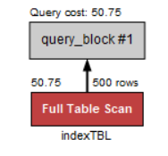
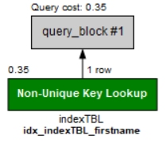
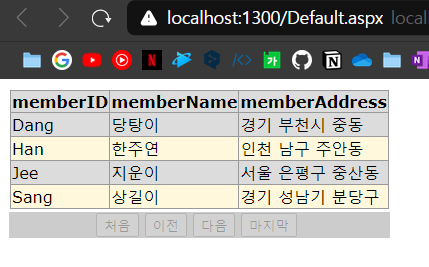

# MySQL 전체 운영 실습

## 데이터베이스 모델링
- 현실 세계에서 사용되는 데이터를 MySQL에 어떻게 옮겨 놓을 것인지 결정하는 과정이다.
- 분석과 설계 과정 중 가장 중요한 과정 중 하나이다.
  - 요구사항 분석 : **무엇을** 할 것인지 결정하는 단계
  - 설계 : 구축하고자 하는 시스템을 **어떻게** 할 것인지 결정하는 단계

## 필수 용어 정리
- 데이터
  - 하나하나의 **단편적인 정보**
- 테이블
  - 데이터를 **표 형태**로 표현한 것
- 데이터베이스 (DB)
  - **테이블이 저장되는 저장소**
  - 각 데이터베이스는 **서로 다른 고유한 이름**을 가지고 있어야 한다.
- DBMS
  - 데이터베이스를 관리하는 시스템 또는 SW
- 열 (칼럼 = 필드)
- 열 이름
  - **열을 구분하기 위한 이름**이다.
  - 중복되면 안된다.
- 데이터 형식
  - 열의 데이터 형식을 말한다.
  - **테이블을 생성할 때** 열 이름과 함께 **지정**해 줘야 한다.
- 행 (로우 = 레코드)
  - 실질적인 데이터를 말한다.
- 기본 키 열 (Primary Key)
  - 각 행을 구분하는 **유일한** 열
  - 중복되면 안된다.
  - 비어 있으면 안된다.
  - 각 테이블에는 기본 키가 **하나만 지정**되어 있어야 한다.
- 외래 키 필드 (Foreign Key)
  - 두 테이블의 관계를 맺어주는 키를 말한다.
- SQL (Structured Query Language)
  - 사람과 DBMS가 소통하기 위한 언어이다.

* * *
## 데이터베이스 구축 절차
모델링을 한 후,  
데이터베이스 생성 -> 테이블 생성 -> 데이터 입력 -> 데이터 조회/활용  

## Workbench로 데이터베이스 구축
테이블 생성 시 생각해야 할 것들  
- 열 이름
  - 개체 (데이터베이스, 테이블, 열 등) 이름은 영문을 사용해야 한다.
- 데이터 형식
- 길이
- NULL 허용
  - 아무것도 입력하지 않는 것을 허용하는지 여부  

`*` MySQL은 기본적으로 테이블 이름, 열 이름 등을 **모두 소문자로 처리**한다. 대문자로 작성하는 이유는 읽기 편하도록 하기 위함이다.

데이터 활용 시 생각해야 할 것들  
`*` 데이터베이스를 더블클릭 해서 볼드체로 변해야 선택된 데이터베이스이다.
- - -
- 모든 데이터를 조회하는 sql문
```SQL
SELECT * FROM DB이름;
```
- SELECT 기본형식 : SELECT 열 이름 FROM 테이블 이름 [WHERE 조건]
- SQL 예약어
  - SQL문에서 약속된 언어
  - MySQL에서 예약어는 자동으로 파란 색깔로 표시된다.
- - -
```SQL
CREATE TABLE `my TestTBL` (id INT);
```
- 중간에 공백이 있는 개체의 이름을 사용할 때는 백틱(``)로 묶어줘야 하나로 인식한다.
- 테이블 생성 후 새로고침 필수
- - -
```SQL
DROP TABLE `my TestTBL`;
```
- 테이블을 삭제하는 sql문

## 테이블 외의 데이터베이스 개체의 활용
- 테이블 외의 데이터베이스 개체
  - 인덱스
  - 스토어드 프로시저
  - 트리거
  - 함수
  - 커서
### 인덱스 (Index)
* * *
- 책의 '찾아보기'(색인)와 같은 개념이다.
- 데이터베이스 **테이블의 검색 속도를 향상시키기 위한** 자료구조이다.
- 데이터베이스의 성능을 향상시키거나 응답하는 시간을 단축시키는 것에(이를 데이터베이스 튜닝이라고 한다.) 효과적이다.
- 열을 기본 키로 설정하면 자동으로 인덱스가 생성된다.

### 1. 인덱스가 없는 상황에서의 쿼리 작동 확인
SELCET문으로 조회를 하고 결과가 나오면 Execution Plan(실행 계획)을 확인할 수 있다.  
  
Full Table Scan이라고 나와있다.  
이 뜻은 인덱스를 사용하지 않고 테이블 전체를 검색했다는 뜻이다.  
대량의 데이터를 다룰 때 시스템 과부하가 일어날 수 있다.

### 2. 인덱스를 생성 한 후 쿼리 작동 확인
```SQL
CREATE INDEX 인덱스이름 ON 테이블이름(필드이름);
```
인덱스를 생성 후 SELECT문으로 조회를 하고 Execution Plan을 확인해 보면,  
  
Non-Unique Key Lookup이라고 나와있다.  
인덱스를 사용했다는 의미이다.  
**인덱스를 사용해 조회하면 효과적으로 데이터 조회가 가능하다.**

### 뷰 (View)
* * *
- **가상의 테이블**이라 생각하기
- 사용자 입장에선 테이블과 동일하게 보이지만, 실제 행 데이터를 가지고 있지 않다.
- 진짜 **테이블에 Link**된 개념이라 생각하기
- 뷰 생성 방법
  ```SQL
  CREATE VIEW 뷰이름 AS SELECT 필드이름1, 필드이름2 FROM 테이블이름;
  ```

### 스토어드 프로시저 (Stored Procedure)
* * *
- MySQL에서 제공해주는 **프로그래밍 기능**을 말한다.
- **SQL문을 하나로 묶어서 편리하게 사용하는 기능**이다.
  - 실무에서는 매번 수행하는 SELECT문들을 스토어드 프로시저로 묶어 호출하는 방식을 많이 사용한다.

#### 스토어드 프로시저 사용 방법
```SQL
DELIMITER //
CREATE PROCEDURE 프로시저이름()
BEGIN
  SELECT * FROM 테이블이름 WHERE 필드이름 = '값';
  SELECT * FROM 테이블이름2 WHERE 필드이름 = '값';
END //
DELIMITER ;
```
- DELIMITER는 '구분 문자'를 의미한다.
  - 뒤에 //가 나오면 기존의 세미콜론을 대신한다는 의미이다.
  - 제일 마지막 행에서 세미콜론으로 돌려놓아야 한다.
- 호출하는 방법
  ```SQL
  CALL 프로시저이름();
  ```
- CREATE와 DROP 규칙
  - CREATE 개체종류 개체이름 ~~  
    - CREATE VIEW 뷰이름 ~~ , CREATE INDEX 인덱스이름 ~~~
  - DROP 개체종류 개체이름
    - DROP VIEW 뷰이름 , DROP PROCEDURE 프로시저이름

### 트리거 (Trigger)
* * *
- 테이블에 부착되어 INSERT, UPDATE, DELETE 작업이 발생하면 실행되는 코드를 말한다.
- 예시 쿼리문 (삭제 시 삭제된 행이 백업테이블에 저장되는 쿼리문)
  ```SQL
  CREATE TABLE deletedMemberTBL (
	memberID CHAR(8),
    memberName CHAR(5),
    memberAddress CHAR(20),
    deletedDate DATE -- 삭제한 날짜
  );

  DELIMITER //
  CREATE TRIGGER trg_deletedMemberTBL -- 트리거 이름
    AFTER DELETE -- 삭제 후에 작동하게 지정
      ON memberTBL -- 트리거를 부착할 테이블
      FOR EACH ROW -- 각 행마다 적용시킴
  BEGIN
    -- OLD 테이블의 내용을 백업 테이블에 삽입
      INSERT INTO deletedMemberTBL
      VALUES (OLD.memberID, OLD.memberName, OLD.memberAddress, CURDATE() );
  END //
  DELIMITER ;
  ```

## 데이터베이스 백업 및 관리
- 백업
  - 현재의 데이터베이스를 다른 매체에 **보관**하는 작업
  - 다른 디스크에 백업을 받아야 의미가 있다. (디스크 고장 대비)
- 복원
  - 데이터베이스에 문제가 발생했을 때 다른 매체에 백업된 데이터를 이용해서 **원상태로 돌려놓는 작업**

## MySQL과 응용 프로그램의 연결
- Visual Studio Community 2017
- [Connector/ODBC 32bit](https://downloads.mysql.com/archives/c-odbc/)
  - 윈도우의 ODBC Data Sources (32-bit) 실행
  - 시스템 DSN 탭에서 추가 클릭
  - MySQL ODBC 8.0 Unicode Driver 선택 후 작성
- ASP.NET  



#### 알아둘 것
`*` localhost(127.0.0.1)은 자신의 컴퓨터를 의미한다.  
`*` MySQL에서는 "스키마"와 "데이터베이스"가 완전히 동일한 용어로 사용된다. (다른 DBMS에서는 동일한 용어가 아니다.)

### 참고
> 이것이 MySQL이다 개정판 - 한빛미디어, 우재남 지음