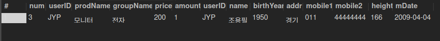

# SQL 고급
# MySQL의 데이터 형식
데이터 형식의 종류는 약 30개 정도 된다.  
그 중 자주 사용되는 데이터 형식만 정리해봤다.
## 1. 숫자 데이터 형식
- SMALLINT : 2byte
- INT : 4byte
- BIGINT : 8byte
- FLOAT : 4byte
  - 소수점 아래 7자리까지 표현
  - 근사치의 숫자 저장
- DECIMAL(m,[d]) : 5~17byte
  - 전체 자릿수(m), 소수점 이하 자릿수(d)
    - 예를 들어 -999999.99 ~ 999999.99는 DECIMAL(9,2)로 표현한다.
  - 정확한 수치 저장
  - 소수점이 들어간 실수를 저장하려면 되도록 DECIMAL을 사용하는 것이 바람직하다.
  - - -
- 부호 없는 정수 지정하는 방법
  - ```sql
    INT UNSIGNED
    BIGINT UNSIGNED
    -- 실수형도 UNSIGNED 예약어를 사용할 수 있지만 자주 사용되지는 않음
    ```
## 2. 문자 데이터 형식
- CHAR(n)
  - CHAR(100)에 'ABC'를 저장한다면 100의 공간을 모두 확보한 후 3자리 사용
    - 97자리 낭비
- VARCHAR(n)
  - VARCHAR(100)의 경우엔 'ABC'를 저장할 때 3자리만 사용
    - 가변길이기 때문에 공간을 효율적으로 운영할 수 있으나 INSERT/UPDATE 시 CHAR형이 더 좋은 성능을 발휘하게 된다.
- LONGTEXT
  - TEXT 형식 (문자 저장)
- LONGBLOB
  - BLOB (Binary Large OBject) 형식
  - 사진 파일, 동영상 파일, 문자 파일 등의 이진 데이터 저장
## 3. 날짜와 시간 데이터 형식
- DATE
  - 'YYYY-MM-DD' 형식
- DATETIME
  - 'YYYY-MM-DD HH:MM:SS' 형식

## 4. 기타 데이터 형식
- GEOMETRY : 공간 데이터 형식. 선, 점 및 다각형 같은 데이터 개체를 저장하고 조작
- JSON : JavaScript Object Notaion 문서를 저장

# 변수의 사용
```sql
SET @변수이름 = 변수의 값; -- 변수 선언 및 초기화
SELECT @변수이름; -- 변수 값 출력
-- @변수명은 전역변수, DECLARE 변수명은 지역변수 (스토어드 프로시저, 함수 등)
-- 변수는 워크벤치를 재시작하면 소멸된다.
```

```sql
-- 변수 활용
-- PREPARE EXECUTE 문 사용하기
SET @myVar1 = 3;

PREPARE myQuery
	FROM 'SELECT Name, height FROM usertbl ORDER BY height LIMIT ?';

EXECUTE myQuery USING @myVar1;
```

# 데이터 형 변환 함수
## 명시적 변환
CAST()와 CONVERT() 함수를 사용하고 형식만 다를 뿐 기능은 비슷하다.
```sql
-- 실수값인 평균을 정수로 형변환하기
SELECT CAST(AVG(amount) AS SIGNED INTEGER) FROM buytbl;
-- 출력값 3 (원래 평균 구매개수는 2.9167)
SELECT CONVERT(AVG(amount), SIGNED INTEGER) FROM buytbl;
```
## 암시적 변환
```sql
SELECT '100' + '200'; -- 문자끼리 더하면 정수로 변환되어 연산됨
SELECT CONCAT('100', '200'); -- 문자 연결은 문자로 처리
SELECT CONCAT(100,'200'); -- 정수와 문자 연결(정수가 문자로 변환되어 처리)
SELECT 1 > '2mega'; -- 정수인 2로 변환되어서 비교
SELECT 0 = 'mega2'; -- 문자는 0으로 변환됨
```

# 내장 함수
자주 사용되는 것들 위주로 정리
## 제어 흐름 함수
- IF(수식, 참일 때 출력할 값, 거짓일 때 출력할 값);
- IFNULL(수식1, 수식2) : 수식1이 NULL -> 수식2 출력, 수식1이 NOTNULL -> 수식1 출력
- NULLIF(수식1, 수식2) : 같으면 NULL, 다르면 수식1 출력
- CASE ~ WHEN ~ ELSE ~ END
```sql
SELECT IF(100 > 200, 'O', 'X'); -- X
SELECT IFNULL(NULL,'널'), IFNULL(100,'널'); -- '널', 100
SELECT NULLIF(100, 100), NULLIF(200,100); -- NULL, 20

SELECT CASE 10
            WHEN 1 THEN '일'
            WHEN 5 THEN '오'
            WHEN 10 THEN '십'
            ELSE '모름'
      END AS 'CASE연습';
-- CASE가 10이르모 '십'이 출력됨
```

## 문자열 함수
- CONCAT_WS()
```sql
SELECT CONCAT_WS('/', '2023', '10','27');
-- 2023/10/27
```
- ELT(), FIELD(), FIND_IN_SET(), INSTR(), LOCATE()
```sql
SELECT ELT(2, '하나', '둘', '셋'), FIELD('둘','하나','둘','셋'), FIND_IN_SET('둘','하나,둘,셋'), INSTR('하나둘셋','둘'), LOCATE('둘','하나둘셋');
-- 둘, 2, 2, 3, 3
```
- FORMAT() : 소수점 아래 자릿수 포함해주고 1000단위마다 콤마 표시해줌
```sql
SELECT FORMAT(123456.123456, 4);
-- 123,456.1235
-- 다섯째자리 5가 반올림되어서 소수점아래 4개만 출력됨
```
- INSERT() : 길이만큼 지우고 문자열 삽입
```SQL
SELECT INSERT('abcdefghi', 3, 4, '@@@@'), INSERT('abcdefghi', 3, 2, '@@@@');
-- 'ab@@@@ghi, 'ab@@@@efghi
```
- LEFT(), RIGHT()
```sql
SELECT LEFT('abcdefghi', 3) , RIGHT('abcdefghi', 3);
-- 'abc', 'ghi'
```
- UPPER(), LOWER() : 대문자, 소문자
- LPAD, RPAD
```sql
SELECT LPAD('이것이', 5, '##'), RPAD('이것이', 5, '##');
-- '##이것이', '이것이##'
```
- LTRIM(), RTRIM(), TRIM(), TRIM({BOTH(양쪽) or LEADING(앞) or TRAILING(뒤) '자를_문자열'} FROM '문자열')
- REPEAT() : 문자열 반복
- REPLACE() : 문자열 대체
- REVERSE() : 문자열 거꾸로 변환
- SPACE() : 길이만큼 공백 반환
- SUBSTRING() : 시작위치부터 길이만큼 문자 반환
- SUBSTRING_INDEX() : 양수면 오른쪽 버리고 음수면 왼쪽을 버린다.
```SQL
SELECT SUBSTRING_INDEX('cafe.naver.com', '.', 2), SUBSTRING_INDEX('cafe.naver.com', '.', -2);
-- 'cafe.naver', 'naver.com'
```

## 숫자 함수
- ABS() : 절댓값
- CEILING(), FLOOR(), ROUND() : 올림, 내림, 반올림
- POW(), SQRT() : 거듭제곱, 제곱근
- MOD() : 나머지값 구하기
- RAND() : 0~ 1미만의 실수
- SIGN() : 양수면 1반환 0이면 0, 음수면 -1 반환
- TRUNCATE() : 위치까지 구하고 나머지 버리기

## 날짜 및 시간 함수
- ADDDATE(), SUBDATE() : 날짜를 더하고 빼는 함수
```sql
SELECT ADDDATE('2025-01-01', INTERVAL 31 DAY); -- 31일 후 날짜 반환
```
- ADDTIME(), SUBTIME() : 시간을 더하고 빼는 함수
```sql
SELECT ADDTIME('2025-01-01', '1:1:1'); -- 1시간 1분 1초 후를 반환
```
- CURDATE() : 현재 연-월-일
- CURTIME() : 현재 시:분:초
- NOW(), SYSDATE() 현재 연-월-일 시:분:초
- YEAR(), MONTH(), DAY(), HOUR(), MINUTE(), SECOND(), MICROSEcond()
- DATE() : 연-월-일 추출
- TIME() : 시:분:초 추출
- DATEDIFF(), TIMEDIFF() : 인자1 - 인자2 결과 반환
- DAYOFWEEK() : 1(일) ~ 7(토) 반환
- MONTHNAME() : 월 이름
- DAYOFYEAR() : 일년 중 몇일이 지났는지 반환
- LAST_DAY()
- MAKEDATE() , MAKETIME()
- PERIOD_ADD(), PERIOD_DIFF()
- QUARTER() : 몇 분기인지 출력
- TIME_TO_SEC() : 시간을 초 단위로 구한다

## 시스템 정보 함수
- USER(), DATABASE() : 현재 사용자와 현재 선택된 데이터베이스를 반환한다.
- FOUND_ROWS() : 바로 앞에 SELECT문으로 조회된 행의 개수를 구한다
- ROW_COUNT() : 입력, 수정, 삭제된 행의 개수를 구한다
- SLEEP() : 쿼리의 실행을 잠시 멈춘다

## MySQL이 제공하는 내장함수 확인하는 곳
[내장함수 사이트 바로가기](https://dev.mysql.com/doc/refman/8.0/en/functions.html)

## LONGTEXT, LONGBLOB 파일 다루기
데이터 입력 (LOAD_FILE())
```sql
INSERT INTO movietbl VALUES
(1, '쉰들러 리스트', '스필버그', '리암 니슨', LOAD_FILE('C:/SQL/Movies/Schindler.txt'), LOAD_FILE('C:/SQL/Movies/Schindler.mp4'));
```
데이터를 파일로 내려받기 (LONGTEXT)
- INTO OUTFILE
```sql
SELECT movie_script FROM movietbl WHERE movie_id=1
  INTO OUTFILE 'C:/SQL/Movies/Schindler.txt'
  LINES TERMINATED BY '\\n'; -- 줄 바꿈 문자도 그대로 저장하기 위한 옵션
```
데이터를 파일로 내려받기 (LONGBLOB)
- INTO DUMPFILE
```sql
SELECT movie_film FROM movietbl WHERE movie_id=1
  INTO DUMPFILE 'C:/SQL/Movies/Schindler.mp4';
```

# 피벗의 구현
- 피벗이란
  - 한 열에 포함된 여러 값을 출력하고, **이를 여러 열로 변환하여** 테이블 반환 식을 회전하고 필요하면 집계까지 수행하는 것을 말한다.
  - 피벗 테이블 사례
  - 피벗 전
    - |이름|계절|amount|
      |---|---|---|
      |Kim|겨울|10|
      |Lee|여름|15|
      |Kim|가을|25|
      |Kim|봄|3|
      |Kim|봄|37|
      |Lee|여름|40|
      |Kim|여름|14|
      |Kim|겨울|22|
      |Lee|여름|64|
  - 피벗 후
    - |이름|봄|여름|가을|겨울|합계|
      |---|---|---|---|---|---|
      |Kim|40|14|25|32|111|
      |Lee|0|79|0|40|119|
  - SUM, IF 함수 그리고 GROUP BY를 활용해서 코드 작성
    - ```sql
      SELECT season,
      SUM(IF(uName='Kim', amount, 0)) as 'Kim',
      SUM(IF(uName='Lee', amount, 0)) as 'Lee',
      SUM(amount) as '합계'
      FROM pivotTest GROUP BY season;
      ```
    - 코드 결과
      - |season|Kim|Lee|합계|
        |---|---|---|---|
        |가을|25|0|25|
        |겨울|32|40|72|
        |봄|40|0|40|
        |여름|14|79|93|
# JSON (JavaScript Object Notation)
- 웹, 모바일 등과 데이터를 교환하기 위한 개방형 표준 포맷
- 속성(key)와 값(value)로 구성됨
- JavaScript에서 파생되었지만 특정 언어에 종속되지 않음 (독립적 데이터 포맷)

## 테이블을 JSON으로 변환하기-- {"name":"임재범", "height":"182"}
```sql
-- JSON_OBJECT() 나 JSON_ARRAY() 함수를 이용하면 된다.
USE sqldb;
SELECT JSON_OBJECT('name', name, 'height', height) AS 'JSON'
FROM usertbl
WHERE height >= 180;
--
-- {"name":"임재범", "height":"182"}
-- {"name":"이승기", "height":"182"}
-- {"name":"성시경", "height":"186"}
```
## JSON 관련 함수
```sql
-- 테이블 이름은 usertbl로 지정
SET @json = '{"usertbl" :
[
	{"name":"임재범","height":182},
    {"name":"이승기","height":182},
    {"name":"성시경","height":186}
]
}';

SELECT JSON_VALID(@json) AS JSON_VALID; -- JSON 형식을 만족하면 1

-- 두 번째 파라미터엔 'one'이나 'all' 둘 중 하나가 올 수 있다.
-- one은 처음 매치되는 하나만 반환하고 all은 매치되는 모든 것을 반환한다.
-- 세 번째 파아미터에 주어진 문자열의 위치를 반환한다. '$.usertbl[2].name'
SELECT JSON_SEARCH(@json, 'one', '성시경') AS JSON_SEARCH;

-- 지정된 위치의 값을 추출한다.
SELECT JSON_EXTRACT(@json, '$.usertbl[2].name') AS JSON_EXTRACT;

-- 새로운 값 추가
SELECT JSON_INSERT(@json, '$.usertbl[0].mDate', '2009-09-09') AS JSON_INSERT;

-- 대체
SELECT JSON_REPLACE(@json, '$.usertbl[0].name', '홍길동') AS JSON_REPLACE;

-- 삭제
SELECT JSON_REMOVE(@json, '$.usertbl[0]') AS JSON_REMOVE;
```

# 조인
## INNER JOIN (내부 조인)
- 가장 많이 사용되는 조인이다. 일반적으로 JOIN 은 INNER JOIN을 가리킨다.
- 양쪽 테이블에 모두 내용이 있는 것만 조인되는 방식이다.
- 사용 방법
```sql
SELECT 열이름
  FROM 첫번째_테이블명
    INNER JOIN 두번째_테이블명
    ON 조인조건
  WHERE 검색조건
```
- 사용 예시
```sql
SELECT *
	FROM buytbl
		INNER JOIN usertbl
			ON buytbl.userID = usertbl.userID
	WHERE buytbl.userID = 'JYP';
-- ON 구문과 WHERE 구문에 '테이블이름.열이름' 형식으로 되어있는 이유는 두 개의 테이블에서 동일한 열 이름이 모두 존재하기 때문이다.
```


- 권장하는 방식
```sql
SELECT B.userID, U.name, B.prodName, U.addr, CONCAT(U.mobile1, U.mobile2) AS '연락처'
	FROM buytbl B
		INNER JOIN usertbl U
			ON B.userID = U.userID
	WHERE B.userID = 'JYP';
```

## OUTER JOIN (외부 조인)
```sql
SELECT 열 목록
FROM 첫번째 테이블(LEFT 테이블)
<LEFT | RIGHT | FULL> OUTER JOIN <두 번째 테이블(RIGHT 테이블)>
ON 조인될 조건
WHERE 검색조건;
```
- LEFT OUTER : 왼쪽 테이블의 것은 모두 출력
- RIGHT OUTER : 오른쪽 테이블의 것은 모두 출력

## CROSS JOIN (상호 조인)
- 한 쪽 테이블의 모든 행들과 다른 쪽 테이블의 모든 행을 조인시키는 기능
- CROSS JOIN의 결과 개수는 두 테이블 개수를 곱한 개수가 된다.
- 주로 테스트로 사용할 많은 용량의 데이터를 생성할 때 사용한다.
  - 이를 '카티션곱'이라고도 부른다.
```sql
SELECT * FROM buytbl CROSS JOIN usertbl;
```

## SELF JOIN (자체 조인)
- 자기 자신과 자기 자신이 조인하는 것이다.

## UNION / UNION ALL / NOT IN / IN
- UNION : 두 쿼리의 결과를 행으로 합치는 것을 말한다. (행을 합친다.)
  - FULL OUTER JOIN은 열을 합치는 개념이다.
- 열의 개수가 같아야 하고 데이터 형식도 같아야 한다.
- ```sql
  SELECT 문장1
    UNION [ALL]
  SELECT 문장2
  ```

- NOT IN 코드로 이해하기
```sql
SELECT name, CONCAT(mobile1, mobile2) AS '전화번호' FROM usertbl
  WHERE name NOT IN (SELECT name FROM usertbl WHERE mobile IS NULL);
-- 두 번째 쿼리에 해당하는 것을 제외
```
- IN 코드로 이해하기
```sql
SELECT name, CONCAT(mobile1, mobile2) AS '전화번호' FROM usertbl
  WHERE name IN (SELECT name FROM usertbl WHERE mobile IS NULL);
-- 두 번째 쿼리에 해당하는 것만 조회
```
# SQL 프로그래밍
## 변수 선언과 초기화
```sql
DECLARE var1 INT; -- var1 변수 선언
SET var1 = 100; -- 변수에 값 대입
```
## IF...ELSE 문
```sql
IF var1 - 100 THEN
  SELECT '100입니다';
ELSE
  SELECT '100이 아닙니다';
END IF;
```

## CASE 문
- IF문과 비슷
```sql
CASE
  WHEN ... THEN
  WHEN ... THEN
  ELSE
END CASE;
```
## WHILE과 ITERATE/LEAVE
- 다른 프로그래밍의 while과 동일한 개념이다
- continue는 ITERATE
- break는 LEAVE

# 오류처리
방식
```sql
DECLARE 액션 HANDLER FOR 오류조건 처리할_문장;
```
- 액션 : CONTINUE와 EXIT 둘 중 하나를 사용한다.
  - CONTINUE가 나오면 '처리할_문장'을 처리한다.
- 오류조건 : 어떤 오류를 처리할 것인지 지정한다.
  - SQLSTATE '상태코드' ex) 1146은 테이블이 없을 때
  - SQLEXCEPTION, SQLWARNING, NOT FOUND 등
- 처리할_문장 : 한 문장 혹은 여러문장이 올 수 있다. 여러 문장일 경우 BEGIN, END로 묶어줄 수 있다.

# 동적 SQL
1. PREPARE, EXECUTE문
```sql
-- 셀렉트문을 바로 실행하지 않고 미리 준비시켜 놓는다.
PREPARE myQuery FROM 'SELECT * FROM usertbl WHERE userID = "EJW"';

-- 준비한 쿼리문 실행
EXECUTE myQuery;

-- 실행 후 문장을 해제해 주는 것이 바람직하다.
DEALLOCATE PREPARE myQuery;
```
2. ?와 USING 사용
```sql
SET @curDATE = CURRENT_TIMESTAMP(); -- 현재 날짜와 시간

PREPARE myQuery FROM 'INSERT INTO myTable VALUES(NULL, ?)';
EXECUTE myQuery USING @curDate;
DEALLOCATE PREPARE myQuery;
```

### 참고
> 이것이 MySQL이다 개정판 - 한빛미디어, 우재남 지음