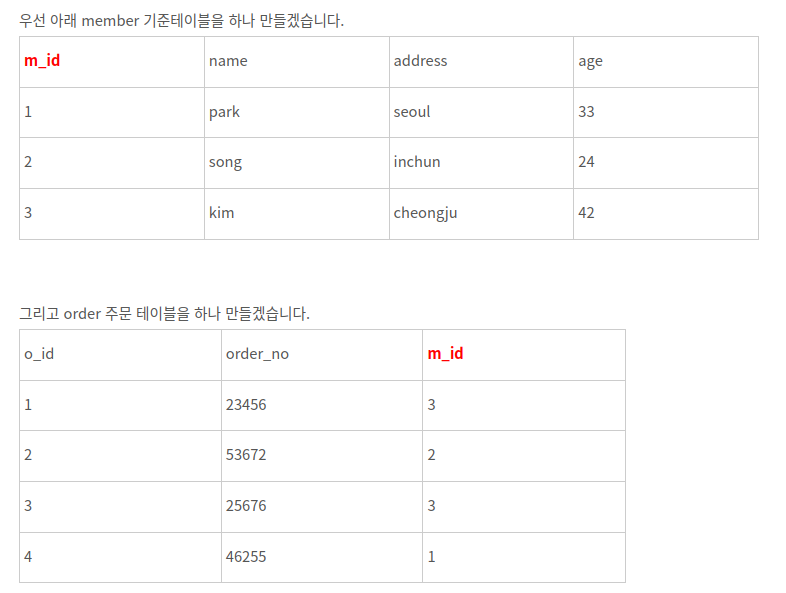

# 테이블과 뷰
## 테이블 생성 시 기본키와 외래키 추가하는 방법
```sql
CREATE TABLE testTbl(
  num INT NOT NULL AUTO_INCREMENT,
  userId INT NOT NULL,
  PRIMARY KEY(num),
  FOREIGN KEY(userId) REFERENCES userTbl(userId)
);
```
또는
```sql
CREATE TABLE testTbl(
  num INT AUTO_INCREMENT NOT NULL PRIMARY KEY,
  userId INT NOT NULL,
  FOREIGN KEY(userId) REFERENCES userTbl(userId)
);
```
- **`AUTO_INCREMENT`** : 1부터 자동으로 번호를 매기며 증가
- PRIMARY KEY는 기본값이 NOT NULL이기 때문에 안써도 되지만 명확히 하기 위해 작성하는 것을 권장함

### FK 추가 시 주의사항
- **참조하는 테이블의 PK에 값이 존재해야**만 FK로 추가해 사용할 수 있다.
  - 자식테이블의 외래키에 데이터를 입력하기 위해서는 입력될 값이 부모테이블의 참조받는 키에 존재해야한다.

### 테이블 삭제 시 알아둘 점
- 자식테이블이 있을 경우(해당 테이블을 참조하는 테이블이 있을 경우) 부모테이블 먼저 삭제 불가
- 삭제는 **자식테이블 -> 부모테이블 순서**로 하기
```sql
DROP TABLE IF EXISTS 자식테이블, 부모테이블;
```

## 제약조건
- 데이터의 **`무결성`** 을 지키기 위한 제한된 조건을 의미한다.
  - **`무결성`** : 데이터의 정확성과 일관성을 유지하고 보증하는 것을 가리킨다

### 기본 키 제약 조건
- 중복 값 X
- NOT NULL 
- 기본키는 테이블 당 하나만 존재해야 한다.
  - 하나의 열로만 구성해야 하는 것은 아니다.
    - 필요에 따라 두 개 혹은 그 이상의 열을 합쳐서 하나의 기본 키로 설정하는 경우도 있다.
- 기본 키의 **이름을 직접 지정**할 수도 있다.
```sql
CREATE TABLE userTbl(
  userID CHAR(8) NOT NULL,
  name VARCHAR(10) NOT NULL,
  CONSTRAINT PRIMARY KEY PK_userTbl_userID (userID)
);
```
- **ALTER**로 테이블 수정할 때 **기본키 추가** (이름 직접 지정)
```sql
ALTER TABLE userTbl
  ADD CONSTRAINT PK_userTbl_userID
    PRIMARY KEY (userID);
```
---
#### 직관적 이해를 위한 용어 정리
- 자식테이블 = 외래키 테이블 (외래키를 정의하는 테이블)
- 부모테이블 = 기준 테이블 (외래키가 참조하는 테이블)
### 외래 키 제약조건
- 외래 키 테이블에 데이터를 입력할 때 기준 테이블을 참조해서 입력하므로 **기준 테이블에 이미 데이터가 존재해야 한다.** ( 외래 키 제약 조건 위반)


# 뷰
하나 이상의 기본 테이블이나 다른 뷰를 이용하여 생성되는 가상 테이블

- 뷰를 생성하는 방법
```sql
-- v_ 를 붙이면 뷰인지 알 수 있으니 사용하는 것 권장
 CREATE VIEW v_usertbl
 AS
  SELECT userid, name, addr FROM usertbl;
```

## 뷰의 장점
1. **보안에 도움이 된다.**
    - 모든 데이터(정보)를 보여주지 않아도 되고 필요한 내용만 보여주면 되기 때문이다.
2. **복잡한 쿼리를 단순화 시켜 줄 수 있다.**
    - 쿼리문을 미리 정의하고 그 과정에서 호출되는 테이블명이 정해지기 때문.

# 테이블스페이스
- **`데이터베이스`** = 테이블이 저장되는 논리적인 공간
- **`테이블스페이스`** = 테이블이 **실제로 저장되는 물리적인 공간**

- 별도의 테이블스페이스를 지정하지 않으면 **`시스템 테이블스페이스`** 에 저장된다.
```sql
-- 시스템 테이블스페이스 확인 방법
SHOW VARIABLES LIKE 'innodb_data_file_path';

-- 출력결과
-- ibdata1:12M:autoextend
-- ibdata1이란 파일에 12MB저장되어 있고 최대 파일 크기는 허용하는 최대값까지 자동 증가한다는 의미이다.
```
- 대용량 테이블을 동시에 여러 개 사용하는 상황이라면 별도의 테이블스페이스를 사용하는 것이 성능에 효과적이다.

### 참고
> 이것이 MySQL이다 개정판 - 한빛미디어, 우재남 지음  
> [SQL FOREIGN KEY 제약 조건 - 진격의 파파](https://makand.tistory.com/entry/SQL-FOREIGN-KEY-%EC%A0%9C%EC%95%BD-%EC%A1%B0%EA%B1%B4)